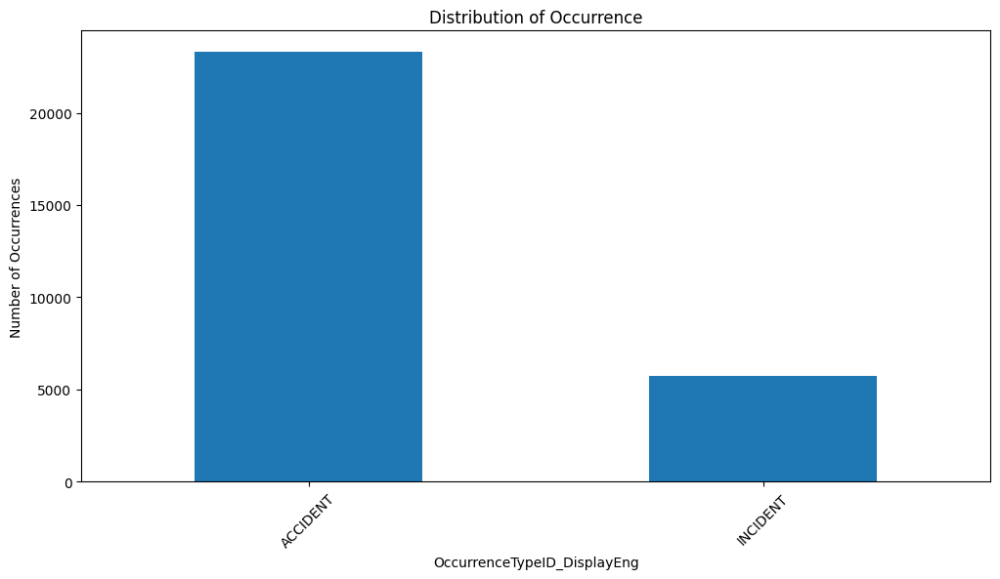
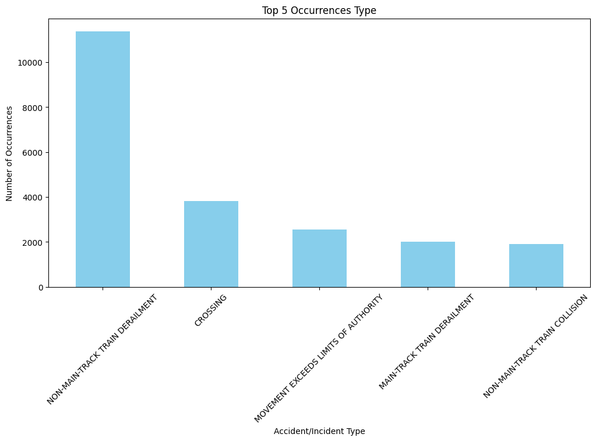
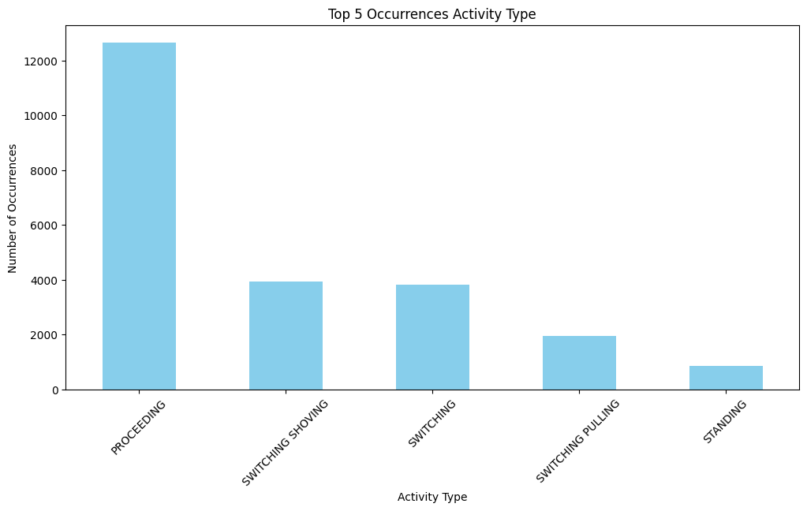
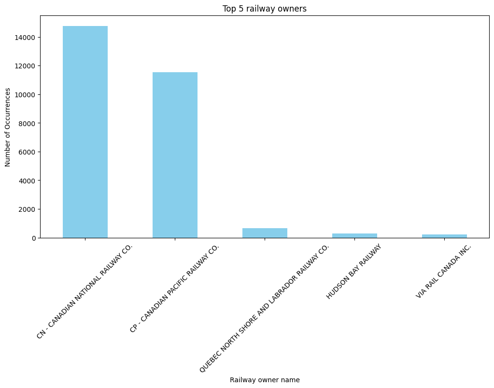
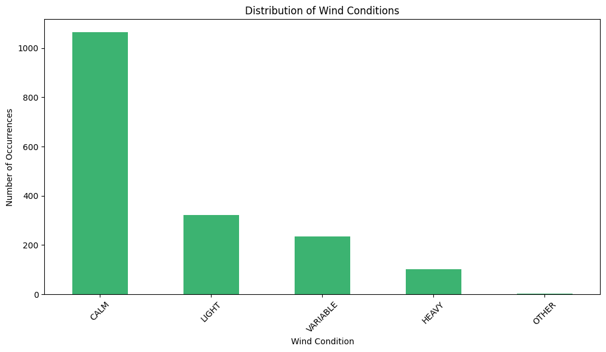
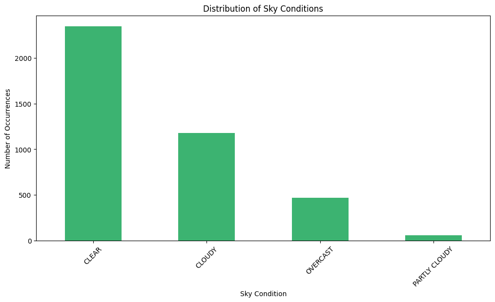
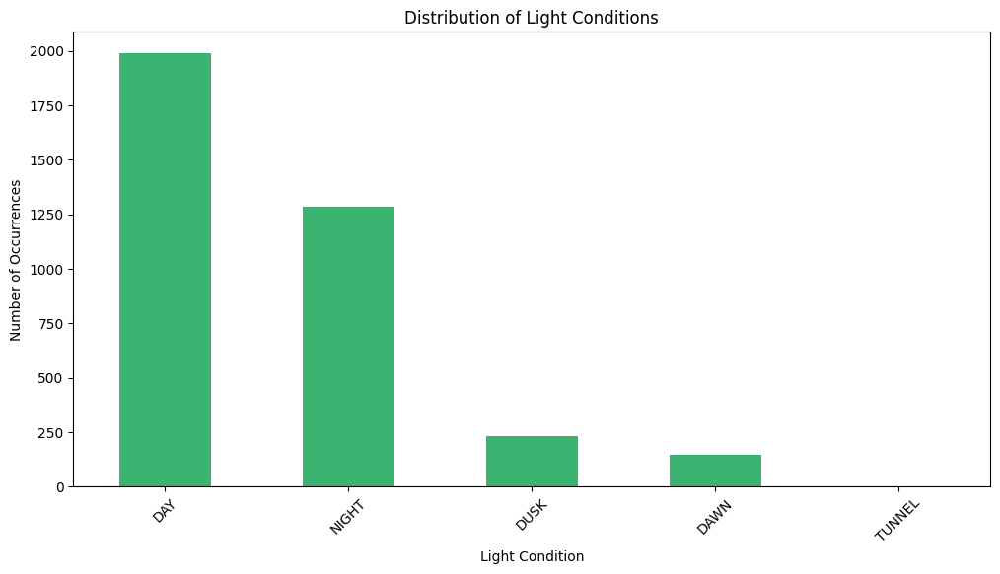
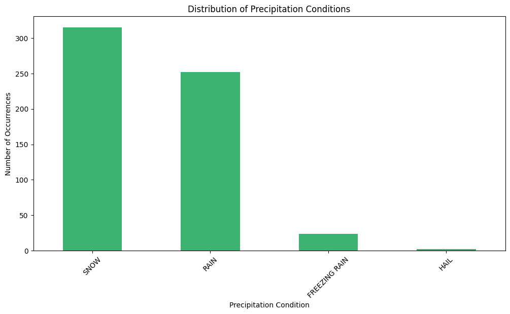
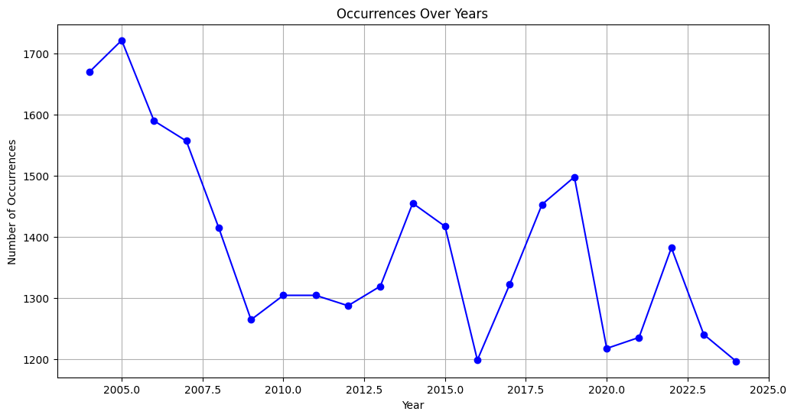
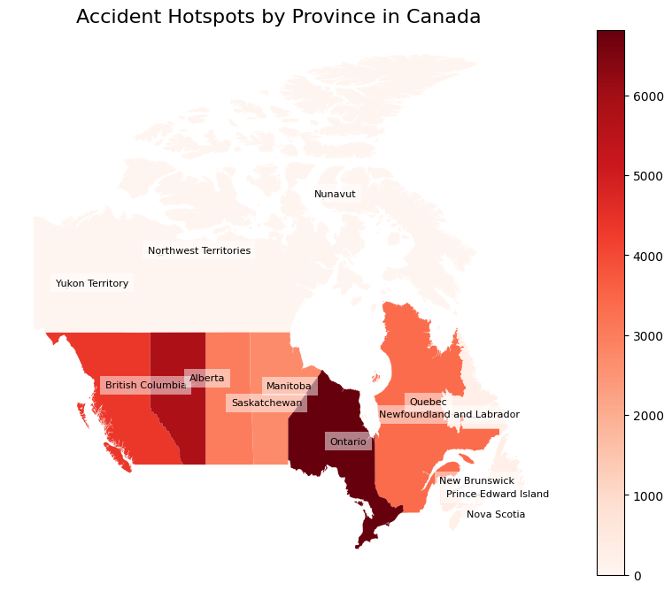

# Main Report

## Import Required Libraries

``` python
import pandas as pd
import numpy as np
import matplotlib.pyplot as plt
import geopandas as gpd
from shapely.geometry import Point
from folium.plugins import MarkerCluster
from adjustText import adjust_text
```

## Load and Merge Datasets

``` python
components = pd.read_csv('datasets\COMPONENTS_PUBLIC.csv', low_memory=False)
injuries = pd.read_csv('datasets\INJURIES_PUBLIC.csv', low_memory=False)
occurrence = pd.read_csv('datasets\OCCURRENCE_PUBLIC.csv', low_memory=False)
train = pd.read_csv('datasets\TRAIN_PUBLIC.csv', low_memory=False)

merged_df = components.merge(injuries, on='OccID', how='outer', suffixes=('', '_injuries'))
merged_df = merged_df.merge(occurrence, on='OccID', how='outer', suffixes=('', '_occurrence'))
merged_df = merged_df.merge(train, on='OccID', how='outer', suffixes=('', '_train'))
```
## Handle Duplicate Columns

``` python
for col in merged_df.columns:
    if '_injuries' in col or '_occurrence' in col or '_train' in col:
        original_col = col.split('_')[0]
        if original_col in merged_df.columns:
            merged_df[original_col] = merged_df[original_col].combine_first(merged_df[col])
        merged_df.drop(columns=[col], inplace=True)
```

## Inspect Data Types and Missing Values

``` python
print(merged_df.dtypes)
merged_df.isnull().sum()
```

```
    OccNo                            object
    OccID                             int64
    ComponentSeq                    float64
    SuspectedComponentFailureIND    float64
    TestPerformedIND                float64
                                     ...   
    RSPassengerMinorInjuries        float64
    TotalRSPassengerInjuries        float64
    OtherFatalInjuries              float64
    OtherSeriousInjuries            float64
    OtherMinorInjuries              float64
    Length: 504, dtype: object
``` 


```
    OccNo                               0
    OccID                               0
    ComponentSeq                    73670
    SuspectedComponentFailureIND    73947
    TestPerformedIND                74292
                                    ...  
    RSPassengerMinorInjuries          211
    TotalRSPassengerInjuries          211
    OtherFatalInjuries                211
    OtherSeriousInjuries              211
    OtherMinorInjuries                211
    Length: 504, dtype: int64
``` 

## Remove Unnecessary Columns

``` python
french_columns = [col for col in merged_df.columns if "Fre" in col]
final_dataset = merged_df.drop(columns=french_columns)
```

## Clean and Deduplicate Data

``` python
final_dataset['Class1No'] = final_dataset['Class1No'].replace(r'^\s*$', pd.NA, regex=True)

final_dataset = final_dataset.drop_duplicates(subset='OccID')
```

## Filter Data for Analysis

``` python
df = final_dataset[(final_dataset['OccYear'] >= 2004) & (final_dataset['OccYear'] <= 2024)]
```

## Visualize Data Distributions

``` python
columns_to_plot = ['OccurrenceTypeID_DisplayEng']
for column in columns_to_plot:
    value_counts = df[column].value_counts()
    plt.figure(figsize=(12, 6))
    value_counts.plot(kind='bar')
    plt.title(f'Distribution of Occurrence')
    plt.xlabel(column)
    plt.ylabel('Number of Occurrences')
    plt.xticks(rotation=45)
    plt.show()
```


``` python
acc_inc_counts = df['AccIncTypeID_DisplayEng'].value_counts().head(5)
plt.figure(figsize=(12, 6))
acc_inc_counts.plot(kind='bar', color='skyblue')
plt.title('Top 5 Occurrences Type')
plt.xlabel('Accident/Incident Type')
plt.ylabel('Number of Occurrences')
plt.xticks(rotation=45)
plt.show()
```


``` python
counts = df['ActivityTypeID_DisplayEng'].value_counts().head(5)
plt.figure(figsize=(12, 6))
counts.plot(kind='bar', color='skyblue')
plt.title('Top 5 Occurrences Activity Type')
plt.xlabel('Activity Type')
plt.ylabel('Number of Occurrences')
plt.xticks(rotation=45)
plt.show()
```


``` python
counts_owner = df['SubdOwnerID_DisplayEng'].value_counts().head(5)
plt.figure(figsize=(12, 6))
counts_owner.plot(kind='bar', color='skyblue')
plt.title('Top 5 railway owners')
plt.xlabel('Railway owner name')
plt.ylabel('Number of Occurrences')
plt.xticks(rotation=45)
plt.show()
```


``` python
wind_counts = df['WindID_DisplayEng'].value_counts()
plt.figure(figsize=(12, 6))
wind_counts.plot(kind='bar', color='mediumseagreen')
plt.title('Distribution of Wind Conditions')
plt.xlabel('Wind Condition')
plt.ylabel('Number of Occurrences')
plt.xticks(rotation=45)
plt.show()
```


``` python
sky_counts = df['SkyConditionID_DisplayEng'].value_counts()
plt.figure(figsize=(12, 6))
sky_counts.plot(kind='bar', color='mediumseagreen')
plt.title('Distribution of Sky Conditions')
plt.xlabel('Sky Condition')
plt.ylabel('Number of Occurrences')
plt.xticks(rotation=45)
plt.show()
```


``` python
light_counts = df['LightConditionID_DisplayEng'].value_counts()
plt.figure(figsize=(12, 6))
light_counts.plot(kind='bar', color='mediumseagreen')
plt.title('Distribution of Light Conditions')
plt.xlabel('Light Condition')
plt.ylabel('Number of Occurrences')
plt.xticks(rotation=45)
plt.show()
```


``` python
Prec_counts = df['PrecipitationTypeID_DisplayEng'].value_counts()
plt.figure(figsize=(12, 6))
Prec_counts.plot(kind='bar', color='mediumseagreen')
plt.title('Distribution of Precipitation Conditions')
plt.xlabel('Precipitation Condition')
plt.ylabel('Number of Occurrences')
plt.xticks(rotation=45)
plt.show()
```


## Visual Representation

``` python
occurrences_by_year = df['OccYear'].value_counts().sort_index()
plt.figure(figsize=(12, 6))
occurrences_by_year.plot(kind='line', marker='o', linestyle='-', color='blue')
plt.title('Occurrences Over Years')
plt.xlabel('Year')
plt.ylabel('Number of Occurrences')
plt.grid(True)
plt.show()
```


``` python
risk_data = df[['RiskOfCollisionIND', 'EvacuationIND', 'UncontrolledMovementRSIND']].sum()
plt.figure(figsize=(8, 8))
risk_data.plot(kind='pie', autopct='%1.1f%%', labels=['Collision Risk', 'Evacuation', 'Uncontrolled Movement'])
plt.title('Proportion of Risk Indicators')
plt.ylabel('')
plt.show()
```


## Geo Spatial Analysis

``` python
def dms_to_dd_bulk(column):
    degrees = column // 10000
    minutes = (column % 10000) // 100
    seconds = column % 100
    return degrees + minutes / 60 + seconds / 3600

df.loc[:, "Latitude"] = pd.to_numeric(dms_to_dd_bulk(df["Latitude"]), errors="coerce")
df.loc[:, "Longitude"] = pd.to_numeric(dms_to_dd_bulk(df["Longitude"]), errors="coerce")

df = df.dropna(subset=["Latitude", "Longitude"])
df = df[(df["Latitude"].between(-90, 90)) & (df["Longitude"].between(-180, 180))]

df.loc[df['Longitude'] > 0, 'Longitude'] = -df['Longitude']

url = "https://raw.githubusercontent.com/codeforamerica/click_that_hood/master/public/data/canada.geojson"
provinces_gdf = gpd.read_file(url)

accidents_gdf = gpd.GeoDataFrame(
    df,
    geometry=[Point(xy) for xy in zip(df["Longitude"], df["Latitude"])],
    crs="EPSG:4326"
)

accidents_by_province = gpd.sjoin(accidents_gdf, provinces_gdf, how="inner", predicate="intersects")

province_accident_counts = accidents_by_province.groupby("name").size().reset_index(name="Accident_Count")

provinces_gdf = provinces_gdf.merge(
    province_accident_counts,
    left_on="name",
    right_on="name",
    how="left"
).fillna({"Accident_Count": 0})

from adjustText import adjust_text

fig, ax = plt.subplots(1, 1, figsize=(14, 8))
provinces_gdf.plot(
    column="Accident_Count",
    cmap="Reds",
    legend=True,
    ax=ax
)

texts = []
for idx, row in provinces_gdf.iterrows():
    centroid = row["geometry"].centroid
    texts.append(ax.text(
        centroid.x, centroid.y,
        row["name"],
        fontsize=8,
        ha="center",
        color="black",
        bbox=dict(facecolor='white', alpha=0.5, edgecolor='none')
    ))


adjust_text(
    texts,
    arrowprops=dict(arrowstyle="-", color="gray", alpha=0.5)
)

ax.set_title("Accident Hotspots by Province in Canada", fontsize=16)
plt.axis("off")
plt.show()
```



