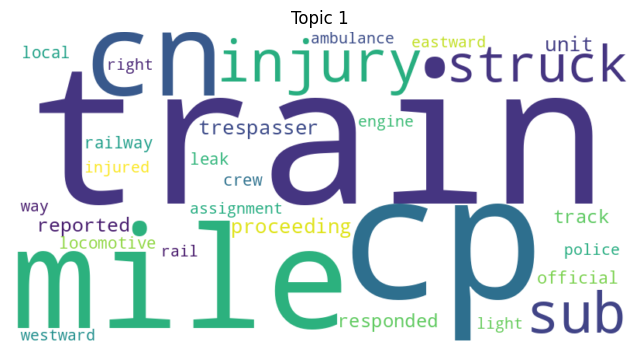
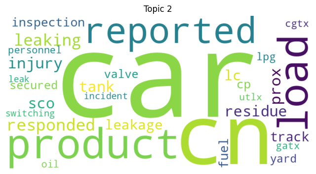
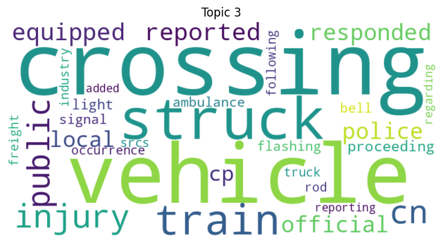
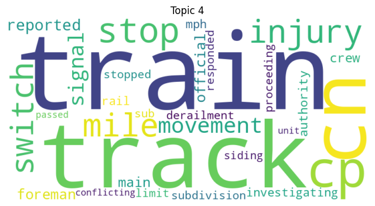
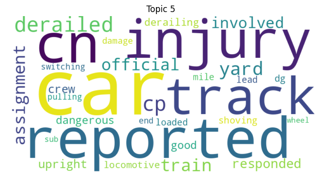

# Topic Modelling

## Import Required Libraries

``` python
import pandas as pd
import re
import nltk
from sklearn.feature_extraction.text import CountVectorizer, TfidfVectorizer
from sklearn.decomposition import LatentDirichletAllocation
import matplotlib.pyplot as plt
from wordcloud import WordCloud
from gensim.models import LdaModel
from gensim.corpora import Dictionary
from gensim.models import CoherenceModel
import pyLDAvis
import pyLDAvis.gensim_models as gensimvis
```
## Download necessary NLTK data

``` python
nltk.download('stopwords')
nltk.download('wordnet')
```
## Load the dataset

``` python
df = pd.read_csv('data/final_dataset.csv')
df['Summary'] = df['Summary'].fillna('')  
```
## Preprocessing function

``` python
def preprocess_text(text):
    text = text.lower()
    text = re.sub(r'[^\w\s]', '', text)
    tokens = text.split()
    stopwords = nltk.corpus.stopwords.words('english')
    tokens = [word for word in tokens if word not in stopwords]
    lemmatizer = nltk.stem.WordNetLemmatizer()
    tokens = [lemmatizer.lemmatize(word) for word in tokens]
    return ' '.join(tokens)
```

## Apply preprocessing to the 'Summary' column

``` python
df['Processed_Summary'] = df['Summary'].apply(preprocess_text)
```
## Vectorization

``` python

vectorizer = CountVectorizer(max_df=0.95, min_df=2, max_features=1000, stop_words='english')
dtm = vectorizer.fit_transform(df['Processed_Summary'])
```
## LDA Model

``` python
lda = LatentDirichletAllocation(n_components=5, random_state=42)
lda.fit(dtm)
```
## Display topics

``` python
def display_topics(model, feature_names, no_top_words):
    for topic_idx, topic in enumerate(model.components_):
        print(f"Topic {topic_idx}:")
        print(" ".join([feature_names[i] for i in topic.argsort()[:-no_top_words - 1:-1]]))

no_top_words = 10
display_topics(lda, vectorizer.get_feature_names_out(), no_top_words)
```

```
['Topic 1: track, unit, rail, derailed, switch',
 'Topic 2: cp, reported, cars, train, cn',
 'Topic 3: cn, mile, sub, cp, track',
 'Topic 4: vehicle, crossing, struck, police, train',
 'Topic 5: car, product, cn, leaking, load']
``` 

## Generate word clouds for each topic

``` python
def plot_word_clouds(lda_model, feature_names, num_topics):
    for topic_idx, topic in enumerate(lda_model.components_):
        plt.figure(figsize=(8, 6))
        word_freqs = {feature_names[i]: topic[i] for i in topic.argsort()[:-30 - 1:-1]}
        wordcloud = WordCloud(background_color='white', width=800, height=400).generate_from_frequencies(word_freqs)
        plt.imshow(wordcloud, interpolation="bilinear")
        plt.axis("off")
        plt.title(f"Topic {topic_idx + 1}")
        plt.show()

plot_word_clouds(lda, vectorizer.get_feature_names_out(), num_topics=5)
```













